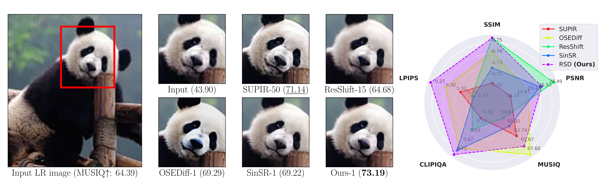

# PyTorch implementation of "One-Step Residual Shifting Diffusion for Image Super-Resolution via Distillation"

This is the official Python implementation of the ICML 2026 paper "One-Step Residual Shifting Diffusion for Image Super-Resolution via Distillation" (poster at ICML will be available [here](https://openreview.net/pdf?id=3WTFzAFHr3)) by [Daniil Selikhanovych](https://scholar.google.com/citations?user=N9bInaYAAAAJ), [David Li](https://scholar.google.com/citations?user=L88Qc4YAAAAJ), [Aleksei Leonov](https://scholar.google.com/citations?user=gzj9nOcAAAAJ), [Nikita Gushchin](https://scholar.google.com/citations?user=UaRTbNoAAAAJ), [Sergei Kushneriuk](https://scholar.google.com/citations?user=D71CiiwAAAAJ), [Alexander Filippov](https://scholar.google.com/citations?user=fY5epnkAAAAJ), [Evgeny Burnaev](https://scholar.google.com/citations?user=pCRdcOwAAAAJ), [Iaroslav Koshelev](https://scholar.google.com/citations?user=gmaJRL4AAAAJ), [Alexander Korotin](https://scholar.google.com/citations?user=1rIIvjAAAAAJ).

Our method code is based on the original [SinSR](https://github.com/wyf0912/SinSR/tree/main) repository, which serves as the primary code source.

<p align="center"></p>

## Requirements

To install all requirements, run the following command: 
```
conda env create --file rsd.yml
conda activate rsd
```

## Training data download

In our work we use the same datasets that were used in ResShift/SinSR/OSEDiff(StableSR) papers. You can find the links for downloading these datasets in our paper, Table 7 in Appendix C. All scripts should be runned in the root of RSD folder.

Download the training part of the ImageNet dataset into the folder `data/training/imagenet` after getting access on the [official ImageNet site](https://www.image-net.org), save it as `data/training/imagenet/ILSVRC2012_img_train.tar` and unpack in `data/training/imagenet/train`. Make sure that the structure of the directory is the following:
```text
data/training/imagenet/
└── train/
    ├── n01440764/
    │   ├── n01440764_10026.JPEG
    │   ├── n01440764_10027.JPEG
    │   └── ...
    └── n01440765/
        └── ...
```

To download and unpack the ImageNet dataset (138GB), run the following command:
```
bash scripts/download_imagenet.sh
```
If your traininig images of ImageNet are stored under the folder `PATH_TO_TRAINING_IMAGENET` instead of `data/training/imagenet/train`, then run
```
mkdir -p data/training/imagenet/train
ln -s PATH_TO_TRAINING_IMAGENET data/training/imagenet/train
```
Example is given in the script `scripts/make_ln_to_imagenet_train.sh`

## Validation data download

Download validation ImageNet-Test (392MB), RealSR-V3 with x4 scale factor (3.96GB), and RealSet65 (4.1MB) datasets under the folders `data/validation/imagenet256`, `data/validation/RealSR_V3`, and `data/validation/realset65`, respectively. 
For RealSR-V3, after downloading unpack it in the folder `data/validation/RealSR_V3_all_images` and collect all test images for the scale factor x4 in the folder `data/validation/RealSR_V3` using the script `scripts/prepare_testing_realsr.py`. For this, run the command:
```
bash scripts/download_sinsr_validation_datasets.sh
```
Make sure that the structure of the directory is the following:
```text
data/validation/
└── imagenet256/
    ├── gt/
    │   ├── ILSVRC2012_val_00000067.png
    │   ├── ILSVRC2012_val_00000073.png
    │   └── ...
    └── lq/
        ├── ILSVRC2012_val_00000067.png
    │   ├── ILSVRC2012_val_00000073.png
    │   └── ...
└── RealSR_V3/
    ├── HR_x4/
    │   ├── Canon_001.png
    │   ├── Canon_002.png
    │   └── ...
    └── LR_x4/
        ├── Canon_001.png
    │   ├── Canon_002.png
    │   └── ...
└── RealSet65/
    ├── 00003.png
    ├── 0003.jpg
    └── ...
```

## Training

1. Download the pre-trained VQGAN and ResShift v1 models from the original repository [link](https://github.com/zsyOAOA/ResShift/releases). Create a folder `weights` and move the checkpoints there. For this, run the command:
```
bash scripts/download_resshift_weights.sh
```

2. Adjust batch size according your GPUs in the [config](configs/RSD.yaml) file. 
    + `train.batch: [training batchsize, validation batchsize]` 
    + `train.microbatch: total batchsize = microbatch * #GPUS * num_grad_accumulation`

3. In case you use other paths for training and validation ImageNet, update data paths in the [config](configs/RSD.yaml) file:
    + `data.train.params.dir_paths: ['data/training/imagenet/train']`
    + `data.val.params.dir_path: data/validation/imagenet256/lq`
    + `data.val.params.dir_path_extra: data/validation/imagenet256/gt`

To run distillation process of ResShift model run the following command:

```
CUDA_VISIBLE_DEVICES=0,1,2,3 torchrun --nproc_per_node=4 main_distill.py --cfg_path ./configs/RSD.yaml --save_dir ./logs/RSD --exp_name rsd_distill_on_imagenet_x4
```

## Download pre-trained model

To download pre-trained model with the results reported in Tables 1, 2, and 3 in our paper, download the model under the [Google Drive link](https://drive.google.com/file/d/1EQbO1Bw2HtGmGad4uk3g2wTFjdH22B2X/view?usp=sharing) as `logs/pretrained_rsd/ema_model_2800.pth`. For this, run the following command:
```
bash scripts/download_pretrained_rsd.sh
```

## Evaluation  

To reproduce the results of Tables 1 and 2 run the following command:

```
bash scripts/evaluate_pretrained_rsd_on_imagenet_test.sh
bash scripts/evaluate_pretrained_rsd_on_fullsize_realsr_test.sh
bash scripts/evaluate_pretrained_rsd_on_fullsize_realset65.sh
```

Metrics will be saved as `metrics_fold/imagenet_test.csv`, `metrics_fold/realsr.csv`, and `metrics_fold/realset65.csv`, respectively.

## Results

The main results are presented in our paper, Tables 1–3

###  Quantitative results of our model on real-world datasets  

| Dataset     | PSNR↑   | SSIM↑   | LPIPS↓   | CLIPIQA↑ | MUSIQ↑   |
|-------------|---------|---------|----------|-----------|----------|
| RealSR      | 25.91   | 0.754 | 0.273 | 0.7060    | 65.860   |
| RealSet65   | –       | –       | –        | 0.7267    | 69.172 |

### Quantitative results of our model on fixed size datasets  

| Dataset                       | PSNR↑  | SSIM↑  | LPIPS↓ | DISTS↓ | NIQE↓ | MUSIQ↑ | MANIQA↑ | CLIPIQA↑ |
|-------------------------------|--------|--------|--------|--------|--------|--------|---------|-----------|
| ImageNet-Test (256x256)                 | 24.31  | 0.6570 | 0.1930 | –      | –      | 58.947 | –       | 0.6810    |
| DIV2K-Val (512×512 crops)     | 23.91  | 0.6042 | 0.2857 | 0.1940 | 5.1987 | 68.05  | 0.5937  | 0.6967    |
| DRealSR (512×512 crops)       | 27.40  | 0.7559 | 0.3042 | 0.2343 | 6.2577 | 62.03  | 0.5625  | 0.7019 |
| RealSR (512×512 crops)        | 25.61  | 0.7420 | 0.2675 | 0.2205 | 5.7500 | 66.02  | 0.5930  | 0.6793    |


## Contributing

This project is licensed under [CC BY-NC-SA 4.0](https://creativecommons.org/licenses/by-nc-sa/4.0/legalcode). Redistribution and use should follow this license.

Parts of this repository are licensed by https://github.com/wyf0912/SinSR and https://github.com/zsyOAOA/ResShift